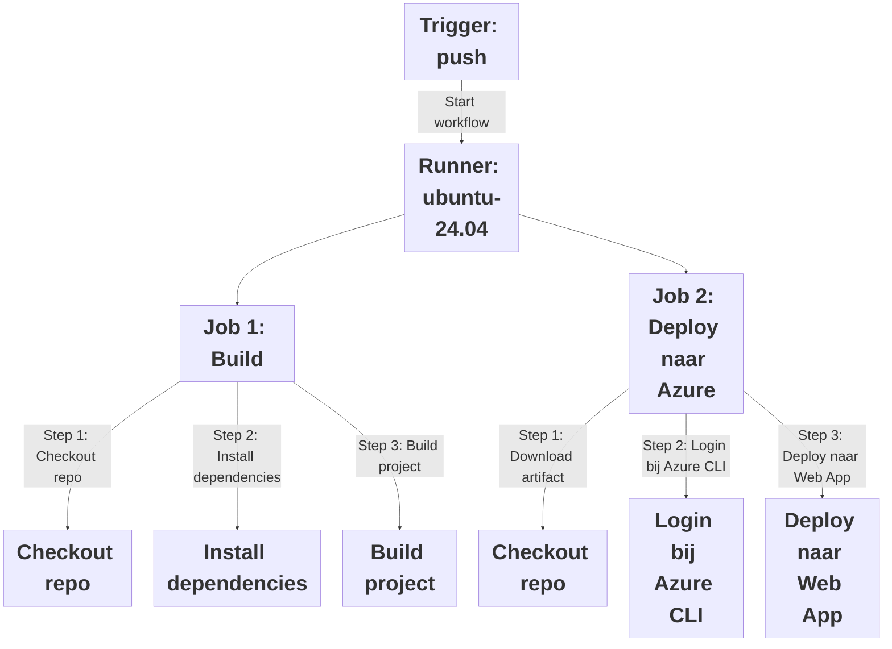

# GitHub Actions

<span class="font-extralight">
  Automate, customize, and execute your software development workflows right in your repository with GitHub Actions. You can discover, create, and share actions to perform any job you'd like, including CI/CD, and combine actions in a completely customized workflow.<sup>1</sup>
</span>

<Footnotes separator>
  <Footnote :number=1><a href="https://docs.github.com/en/actions" rel="noreferrer" target="_blank">GitHub - Actions documentation</a></Footnote>
</Footnotes>

---
layout: figure
transition: fade
figureUrl: img/github-actions/gha-hero.webp
figureFootnoteNumber: 1
---

<Footnotes separator>
  <Footnote :number=1>Afbeelding: <a href="https://github.com/features/actions" rel="noreferrer" target="_blank">GitHub Features - Actions</a></Footnote>
</Footnotes>

# GitHub Actions

---
layout: two-cols
transition: fade
---

# GitHub Actions

## Workflow

- Configureerbaar automatisch proces
- _YAML_-bestand; Woont in je Git-repo
- Bestaat uit:
  - **Trigger(s)**
    - Vb: Een push naar de `release` branch
  - **Job(s)**
    - Vb: **test**, **build** of **deploy** job
    - Bestaat uit:
      - **Runner**
        - Vb: `windows-2022` of `ubuntu-24.04`
      - **Steps**
          - Vb: **Checkout** of **npm run build**

::right::

<div style="display: flex; align-items: center; justify-content: center; height: 100%;">
<div style="width: 100%;">



</div>
</div>

---
transition: fade
---

# GitHub Actions - Voorbeeld workflow

## Naam en 1 trigger

```yaml
# Naam van de workflow
name: Deploy NodeJS backend to Azure

# Lijst met triggers
on:
  push:
    branches:
      - production
```

---
transition: fade
---

# GitHub Actions - Voorbeeld workflow

## 1 job met 5 steps (2 typen)

```yaml
jobs:
  build-and-deploy:
    runs-on: ubuntu-24.04                                       # Runner waar de job op zal draaien

    steps:
      - name: Checkout repository                               # Git checkout
        uses: actions/checkout@v4                               # Gebruikt: Officiele GH 'checkout' action

      - name: Setup NodeJS                                      # Juiste tools en versies installeren
        uses: actions/setup-node@v4                             # Gebruikt: Officiele GH 'setup-node' action
        with:
          node-version: 22

      - name: Install dependencies                              # Downloaden project dependencies
        run: npm ci

      - name: Build project                                     # Build productieversie
        run: npm run build

      - name: Deploy to Azure Web App                           # Deploy to Azure
        uses: azure/webapps-deploy@v3                           # Gebruikt: Officiele Azure 'webapps-deploy' action
        with:
          app-name: myDemoBackend
          publish-profile: ${{ secrets.AZURE_PUBLISH_PROFILE }}
```
